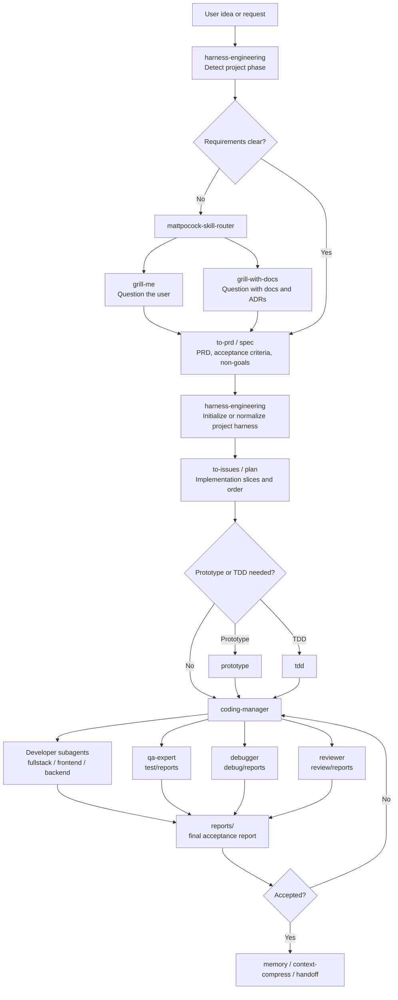
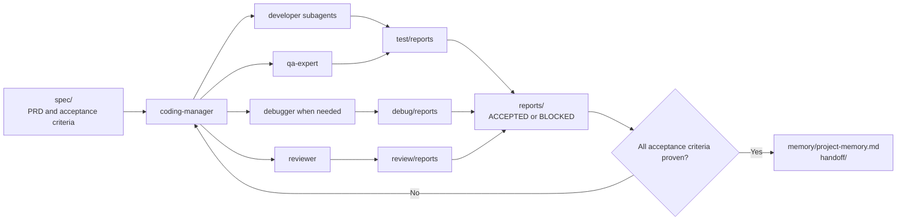

# Harness Engineering Wang

An AI-assisted software engineering harness for Codex-style skill workflows.

This repository packages a staged skill stack for turning vague software ideas into PRDs, executable plans, `coding-manager` delivery, subagent QA/review/debug loops, and durable project memory.

## Core Idea

```text
Ask requirements
-> Write PRD
-> Initialize or normalize the project harness
-> Split implementation slices
-> Deliver with coding-manager and subagents
-> Write test/debug/review evidence
-> Produce final acceptance report
-> Save memory and handoff context
```

## Repository Skill Layout

The repository is grouped by workflow stage for humans:

```text
skills/
  00-harness/
    harness-engineering
  10-workflow-router/
    mattpocock-skill-router
  20-requirements-prd/
    grill-me
    grill-with-docs
    to-prd
    spec
  30-planning-prototyping/
    to-issues
    plan
    prototype
  40-delivery-manager/
    coding-manager
  50-research/
    research
  60-debugging/
    debug
    diagnose
  70-validation-review/
    test
    tdd
    review
  80-memory-handoff/
    memory
    context-compress
    handoff
  90-architecture-triage/
    improve-codebase-architecture
    triage
    zoom-out
  99-fallback-multi-agent/
    multi-agent
```

Codex installs skills as a flat directory, so the installer expands this staged layout into `~/.codex/skills`.

## Workflow Roles

- `harness-engineering`: top-level project harness, project structure, `AGENTS.md`, evidence directories, workflow rules.
- `mattpocock-skill-router`: routes to the right engineering workflow.
- `grill-me` / `grill-with-docs`: question the user until requirements are clear.
- `to-prd` / `spec`: write PRD, acceptance criteria, non-goals, and implementation slices.
- `to-issues` / `plan` / `prototype`: split the PRD into executable work and validate uncertain flows.
- `coding-manager`: main PRD-to-code delivery controller.
- `research`: investigate external APIs, libraries, papers, and technical decisions.
- `debug` / `diagnose`: reproduce, isolate, fix, and verify failures.
- `test` / `tdd` / `review`: prove behavior and independently audit the result.
- `memory` / `context-compress` / `handoff`: preserve durable facts and transfer context.
- `multi-agent`: fallback only; for software delivery, prefer `coding-manager`.

## Canonical Flow

```text
User has a vague idea
-> harness-engineering identifies the project phase
-> mattpocock-skill-router selects the requirement workflow
-> grill-me / grill-with-docs asks focused questions
-> to-prd / spec writes PRD and acceptance criteria
-> harness-engineering initializes or normalizes the project harness
-> to-issues / plan creates implementation slices
-> coding-manager selects subagents and delivers code
-> test / debug / review writes evidence
-> reports/ records final ACCEPTED or BLOCKED status
-> memory / context-compress preserves project context
```



## Generated Project Harness

When applied to a target software project, `harness-engineering` uses this structure:

```text
project/
  assets/
  docs/
  spec/
  tools/
  test/
    STANDARD.md
    reports/
  debug/
    STANDARD.md
    reports/
  review/
    STANDARD.md
    reports/
  reports/
    STANDARD.md
  repos/
    <repo-name>/
  memory/
    STANDARD.md
    project-memory.md
  handoff/
    STANDARD.md
  AGENTS.md
  README.md
  .gitignore
```

The harness is initialized automatically after the PRD or implementation brief is stable, unless doing so would overwrite existing files, conflict with existing conventions, or target an ambiguous project root.

### Codex Project Workspace Layout

In Codex App, the preferred harness root is the visible Project workspace, not a downloaded repository checkout. The repo should live under `repos/<repo-name>/` by default:

```text
codex-project-workspace/
  assets/
  docs/
  spec/
  tools/
  test/
  debug/
  review/
  reports/
  memory/
  handoff/
  repos/
    <repo-name>/
  AGENTS.md
  README.md
```

Workspace-level specs, reports, memory, and handoff files stay at the Project root. Repo-specific commands and source edits run inside the relevant `repos/<repo-name>/` checkout. See `docs/codex-project-workspace-harness-prd.md`.

## Evidence Loop

The generated target project stores evidence outside chat:

- `test/reports/`: commands run, passing checks, failing checks, coverage gaps.
- `debug/reports/`: symptom, reproduction, root cause, fix, regression verification.
- `review/reports/`: findings, open questions, test gaps, final `OK` or `NOT OK`.
- `reports/`: final acceptance report, `ACCEPTED` or `BLOCKED`.
- `memory/project-memory.md`: durable project facts and conventions.
- `handoff/`: compact continuation notes for future agents.

`coding-manager` should inspect these reports before declaring delivery complete.



## Install

Install the staged skill stack into Codex's flat skills directory and install `coding-manager` subagent TOML files into `~/.codex/agents`:

```powershell
.\scripts\install-skills.ps1 -Overwrite
```

Custom destinations:

```powershell
.\scripts\install-skills.ps1 -Destination "$env:USERPROFILE\.codex\skills" -AgentsDestination "$env:USERPROFILE\.codex\agents" -Overwrite
```

Restart or refresh Codex so the new skills and agents are discovered.

## Included Subagents

`coding-manager` includes these TOML subagent definitions:

```text
architect-reviewer
backend-developer
business-analyst
debugger
documentation-engineer
frontend-developer
fullstack-developer
qa-expert
reviewer
security-auditor
```

## Example Prompts

```text
Use $harness-engineering to turn this idea into a PRD-driven software delivery workflow.
```

```text
Use $spec to question me until the requirements are clear, then write the PRD.
```

```text
Use $harness-engineering and $coding-manager to deliver this PRD with subagents and evidence reports.
```

## Validation Status

Locally verified before push:

- Staged repository layout installs into 23 flat Codex skills.
- `coding-manager` installs 10 subagent TOML files.
- Representative critical skills pass `quick_validate.py`.
- Matt workflow skills match the local originals.
- `coding-manager` subagent TOML files are preserved byte-for-byte.
- Audit agent accepted the generated project evidence template against the PRD.

## Chinese README

See [README.zh-CN.md](README.zh-CN.md).
