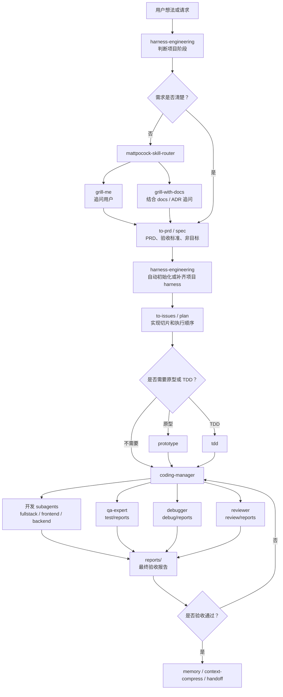
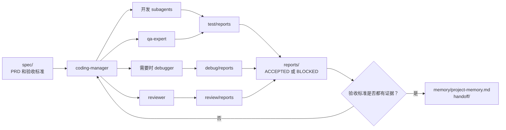

# Harness Engineering Wang

这是一套面向 Codex 类 AI 编程工作流的 Harness Engineering 技能组。

它的目标不是让 AI 直接猜着写代码，而是把软件开发变成一条可审计、可验证、可交接的工程流程：先问需求，写 PRD，初始化项目 harness，拆任务，再由 `coding-manager` 分配 subagent 交付，最后留下测试、调试、审查和验收证据。

## 核心逻辑

```text
问需求
-> 写 PRD
-> 初始化或补齐项目 harness
-> 拆实现切片
-> coding-manager 调 subagent 交付
-> 写 test/debug/review 证据
-> 生成最终验收报告
-> 记录 memory 和 handoff
```

## 仓库技能目录

仓库里按工作流阶段组织，方便人理解：

```text
skills/
  00-harness/
    harness-engineering
  10-workflow-router/
    mattpocock-skill-router
  20-requirements-prd/
    grill-me
    grill-with-docs
    to-prd
    spec
  30-planning-prototyping/
    to-issues
    plan
    prototype
  40-delivery-manager/
    coding-manager
  50-research/
    research
  60-debugging/
    debug
    diagnose
  70-validation-review/
    test
    tdd
    review
  80-memory-handoff/
    memory
    context-compress
    handoff
  90-architecture-triage/
    improve-codebase-architecture
    triage
    zoom-out
  99-fallback-multi-agent/
    multi-agent
```

Codex 本地安装时需要扁平目录，所以安装脚本会把这个分阶段目录展开到 `~/.codex/skills`。

## 各 Skill 职责

- `harness-engineering`：总控项目 harness、目录结构、`AGENTS.md`、证据目录、流程规则。
- `mattpocock-skill-router`：选择合适的工程工作流。
- `grill-me` / `grill-with-docs`：逐步追问需求，直到需求清楚。
- `to-prd` / `spec`：写 PRD、验收标准、非目标和实现切片。
- `to-issues` / `plan` / `prototype`：把 PRD 拆成可执行任务，并验证不确定流程。
- `coding-manager`：PRD 到代码交付的主控制器。
- `research`：调研外部 API、库、论文和技术方案。
- `debug` / `diagnose`：复现、隔离、修复并验证失败。
- `test` / `tdd` / `review`：证明行为正确，并做独立审查。
- `memory` / `context-compress` / `handoff`：保存长期事实和交接上下文。
- `multi-agent`：备用；软件交付优先使用 `coding-manager`。

## 标准主流程

```text
用户提出模糊想法
-> harness-engineering 判断项目阶段
-> mattpocock-skill-router 选择需求澄清流程
-> grill-me / grill-with-docs 逐步追问需求
-> to-prd / spec 写 PRD 和验收标准
-> harness-engineering 自动初始化或补齐项目 harness
-> to-issues / plan 拆实现切片
-> coding-manager 选择 subagent 并交付代码
-> test / debug / review 写证据
-> reports/ 记录最终 ACCEPTED 或 BLOCKED
-> memory / context-compress 沉淀项目上下文
```



## 生成的目标项目结构

当 `harness-engineering` 应用到一个软件项目时，会使用这套结构：

```text
project/
  assets/
  docs/
  spec/
  tools/
  test/
    STANDARD.md
    reports/
  debug/
    STANDARD.md
    reports/
  review/
    STANDARD.md
    reports/
  reports/
    STANDARD.md
  repos/
    <repo-name>/
  memory/
    STANDARD.md
    project-memory.md
  handoff/
    STANDARD.md
  AGENTS.md
  README.md
  .gitignore
```

PRD 或 implementation brief 稳定后，`harness-engineering` 会自动初始化或补齐这套结构。只有在会覆盖已有文件、和现有项目规范冲突、或目标项目根目录不明确时，才需要先问用户。

### Codex Project 工作区结构

在 Codex App 里，优先把左上角可见的 Project 工作区作为 harness 根目录，而不是把下载下来的 repo checkout 直接当成整个 harness 根目录。repo 默认放在 `repos/<repo-name>/`：

```text
codex-project-workspace/
  assets/
  docs/
  spec/
  tools/
  test/
  debug/
  review/
  reports/
  memory/
  handoff/
  repos/
    <repo-name>/
  AGENTS.md
  README.md
```

workspace 级别的 specs、reports、memory、handoff 留在 Project 根目录；repo 相关命令和源码修改在对应的 `repos/<repo-name>/` checkout 里执行。详见 `docs/codex-project-workspace-harness-prd.md`。

## 证据闭环

生成的目标项目会把执行证据写到文件里，而不是只留在聊天里：

- `test/reports/`：测试命令、通过项、失败项、覆盖缺口。
- `debug/reports/`：症状、复现、根因、修复、回归验证。
- `review/reports/`：审查发现、问题、测试缺口、最终 `OK` 或 `NOT OK`。
- `reports/`：最终验收报告，状态为 `ACCEPTED` 或 `BLOCKED`。
- `memory/project-memory.md`：长期项目事实和约定。
- `handoff/`：给后续 agent 或下一轮任务的上下文交接。

`coding-manager` 在宣布交付完成前，应该读取这些报告来判断是否真正通过验收。



## 安装

安装脚本会做两件事：

1. 把分阶段的 skills 展开安装到 Codex 的扁平 skills 目录。
2. 把 `coding-manager` 的 subagent TOML 安装到 `~/.codex/agents`。

```powershell
.\scripts\install-skills.ps1 -Overwrite
```

自定义安装目录：

```powershell
.\scripts\install-skills.ps1 -Destination "$env:USERPROFILE\.codex\skills" -AgentsDestination "$env:USERPROFILE\.codex\agents" -Overwrite
```

安装后重启或刷新 Codex，让新的 skills 和 agents 被发现。

## 内置 Subagents

`coding-manager` 包含这些 TOML 子代理定义：

```text
architect-reviewer
backend-developer
business-analyst
debugger
documentation-engineer
frontend-developer
fullstack-developer
qa-expert
reviewer
security-auditor
```

## 使用示例

```text
Use $harness-engineering to turn this idea into a PRD-driven software delivery workflow.
```

```text
Use $spec to question me until the requirements are clear, then write the PRD.
```

```text
Use $harness-engineering and $coding-manager to deliver this PRD with subagents and evidence reports.
```

## 验证状态

push 前已在本地验证：

- 分阶段仓库目录可以安装成 23 个 Codex skills。
- `coding-manager` 可以安装 10 个 subagent TOML。
- 关键 skills 通过 `quick_validate.py`。
- Matt workflow skills 与本机原版一致。
- `coding-manager` subagent TOML 字节级保持一致。
- 审计 agent 已按 PRD 验收目标项目证据模板。
